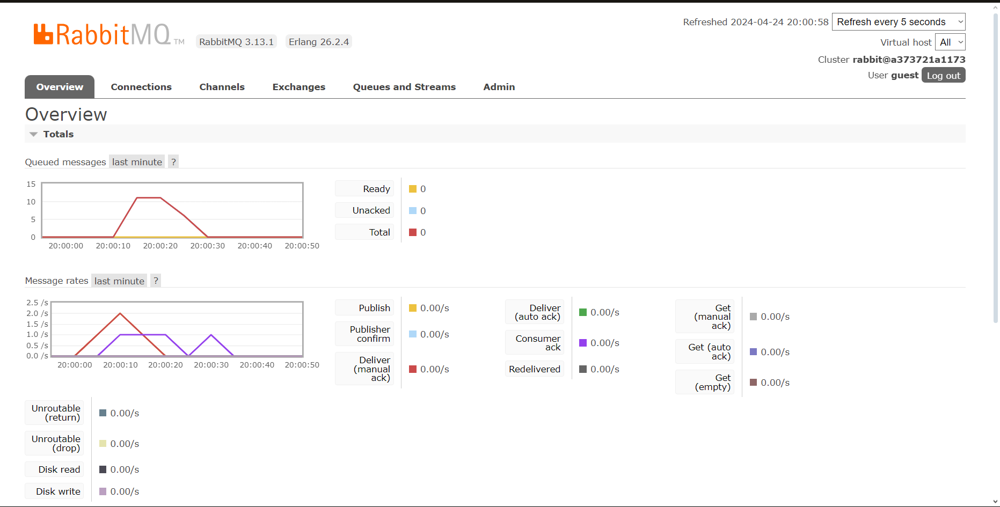
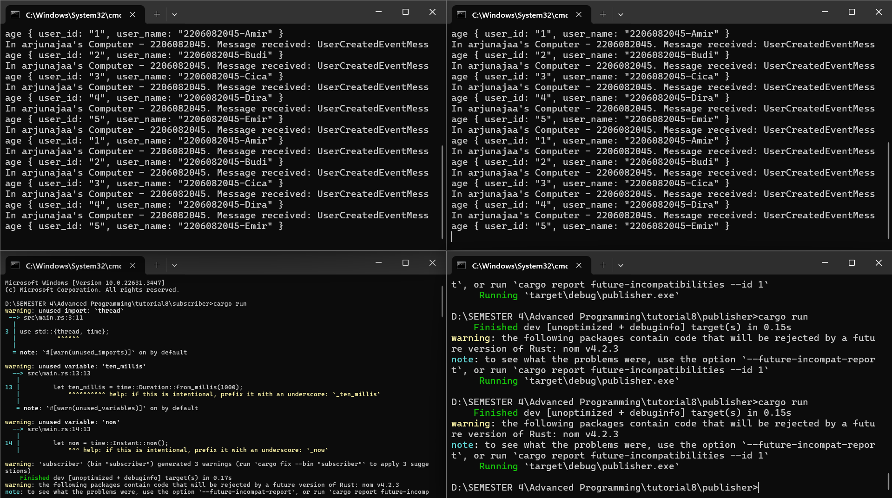
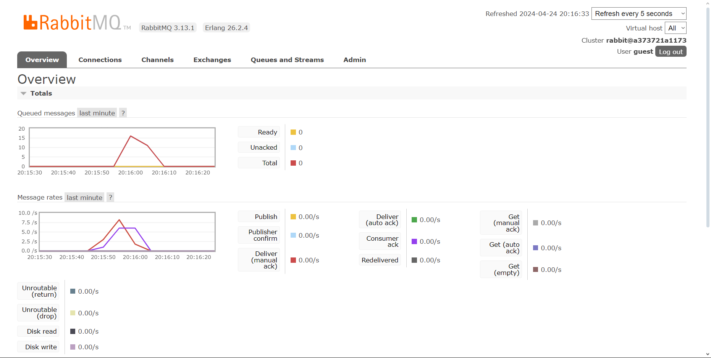

### Modul 8 - Subscriber

#### **Refleksi**

**a. Apa itu AMQP?**

AMQP (Advanced Message Queuing Protocol) adalah protokol open-source untuk komunikasi antara aplikasi atau program komputer. Protokol ini menetapkan aturan untuk mengirim data antar proses yang berjalan pada mesin yang berbeda. Dengan AMQP, aplikasi dapat mengirim dan menerima pesan secara asinkron.

Tujuan utama dari AMQP adalah memastikan pengiriman pesan yang handal dan tingkat interoperabilitas yang tinggi antara aplikasi yang berjalan di berbagai sistem operasi, bahasa pemrograman, dan perangkat keras yang berbeda.

**b. Apa yang Dimaksud dengan `guest:guest@localhost:5672`?**

`guest:guest@localhost:5672` adalah sebuah connection string yang digunakan untuk mengakses server AMQP RabbitMQ. Connection string ini mengikuti format umum: `<username>:<password>@<host>:<port>`.

1. **guest (pertama):** Username untuk autentikasi ke server RabbitMQ. `guest` adalah username bawaan untuk RabbitMQ.
2. **guest (kedua):** Password yang sesuai dengan username `guest` untuk autentikasi. `guest` juga merupakan password bawaan RabbitMQ.
3. **localhost:** Merujuk pada alamat IP 127.0.0.1, yang merupakan alamat loopback untuk mengakses server RabbitMQ yang berjalan pada mesin yang sama. Jika server RabbitMQ berjalan di mesin lain, bagian ini harus diisi dengan nama host atau alamat IP server tersebut.
4. **5672:** Nomor port standar yang digunakan oleh RabbitMQ untuk komunikasi AMQP. Port ini digunakan untuk menerima koneksi dari aplikasi klien yang ingin berkomunikasi dengan server RabbitMQ.

**simulation slow subscriber**

Subscriber mengalami penundaan dalam memproses data dari message broker, yang mengakibatkan penumpukan pesan. Situasi ini terjadi karena publisher mengirim pesan lebih cepat daripada konsumer yang menerima pesan. Akibatnya, jumlah pesan yang mengantre terus meningkat seiring bertambahnya penundaan.

Dalam kasus ini, jumlah maksimum pesan yang mengantre mencapai 11 saat menjalankan aplikasi publisher sebanyak 5 kali menggunakan perintah cargo run. Hal ini menandakan ketidakseimbangan antara kecepatan pengiriman pesan oleh publisher dan kecepatan pemrosesan pesan oleh subscriber.

**Reflection and Running at least three subscribers**

Dalam simulasi slow subscriber sebelumnya, kita melihat bahwa ketika menjalankan lebih dari satu subscriber, pengiriman data menjadi jauh lebih cepat. Dalam contoh ini, jumlah pesan yang masuk ke dalam queued messages pada message broker mencapai 8.

Hal ini terjadi karena message broker mampu secara efisien mendistribusikan data yang diterima dari publisher ke berbagai subscriber yang terhubung. Tanpa perlu mengubah kode program, kita bisa mendapatkan hasil yang berbeda hanya dengan mengatur konfigurasi message broker atau jumlah subscriber yang aktif. Pendekatan ini dikenal sebagai pendekatan event-driven, di mana perilaku sistem ditentukan oleh cara komponen-komponen seperti publisher, subscriber, dan message broker berinteraksi satu sama lain.